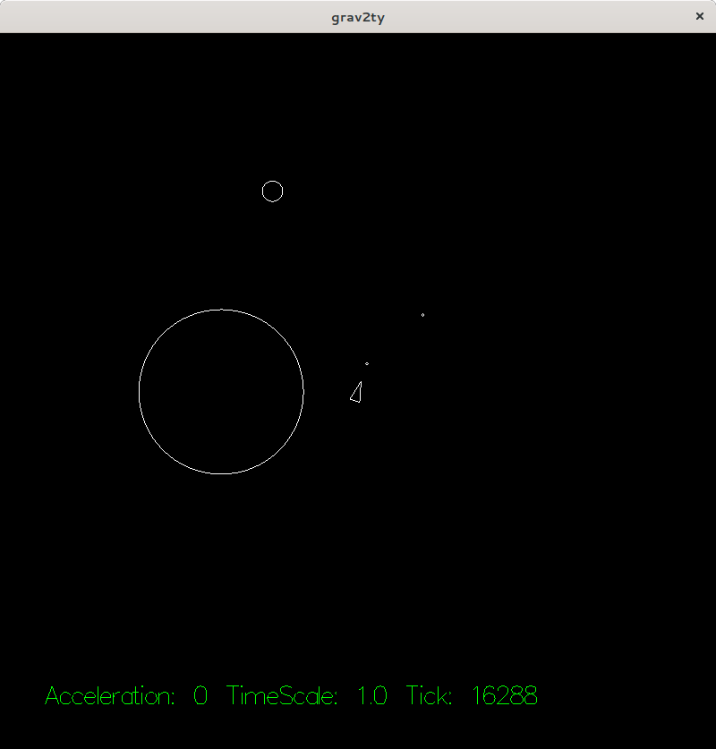

# grav2ty :rocket:

the most realistic asteroids-like game in existence.

## controls

* `up`/`down`: increase/decrease thruster power (ship acceleration)
* `left`/`right`: rotate ship (counter)-clockwise
* `c`: toggle centered view
* `+`/`-`: zoom in/out
* `space`: fire a projectile

## roadmap

- [x] simulation of gravity
- [x] controllable spaceship
- [x] collision detection
- [ ] make measurements more realistic
- [x] allow for zooming the viewport
- [x] ~~time scaling / fast forward~~
- [ ] performance improvements
  - [ ] simplify RelGraph (ordered tuples as keys)
  - [ ] don't calculate gravity to every little object
  - [ ] don't do collision detection at a safe distance
- [x] multi player support
  - [ ] Spawn ships for players
  - [ ] Implement client
  - [ ] Simulate in client
- [x] switch rendering engine
  - [ ] cosmetics (improved models, stars, …)
  - [ ] Introduce a good HUD
  - [ ] main menu, pause menu
  - [ ] Free viewport (mouse moved)
- [ ] gameplay
  - [ ] limit acceleration, fuel?
  - [x] projectiles
    - [ ] Limit firerate
    - [x] make projectiles self-destruct
    - [ ] reduce redundancy in projectile (cannon + object)
  - [ ] mapping support
- [ ] orbit visualization / prediction

## history

* screenshot of [grav2ty at its first commit](./doc/grav2ty-first-commit.png)
* the previous attempt [grav1ty](https://github.com/sternenseemann/grav2ty/tree/grav1ty)
