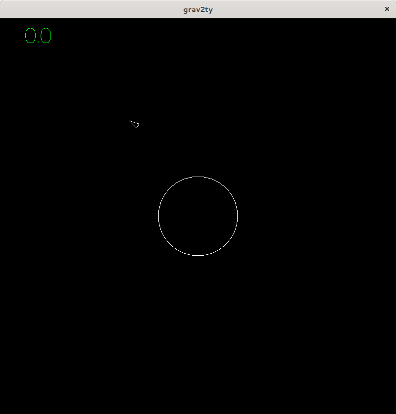

# grav2ty :rocket:

the most realistic asteroids-like game in existence.

## controls

* `up`/`down`: increase/decrease thruster power (ship acceleration)
* `left`/`right`: rotate ship (counter)-clockwise
* `c`: toggle centered view
* `+`/`-`: zoom in/out
* `,`/`.`: slow time down / speed it up

## roadmap

- [x] simulation of gravity
- [x] controllable spaceship
- [x] collision detection
- [ ] make measurements more realistic
- [x] allow for zooming the viewport
- [x] time scaling / fast forward
- [ ] rework HUD, log additional info to console
- [ ] cosmetics (improved models, stars, …)
- [ ] projectiles & targets
- [ ] multi player support (?)
- [ ] switch rendering engine
- [ ] orbit visualization / prediction
